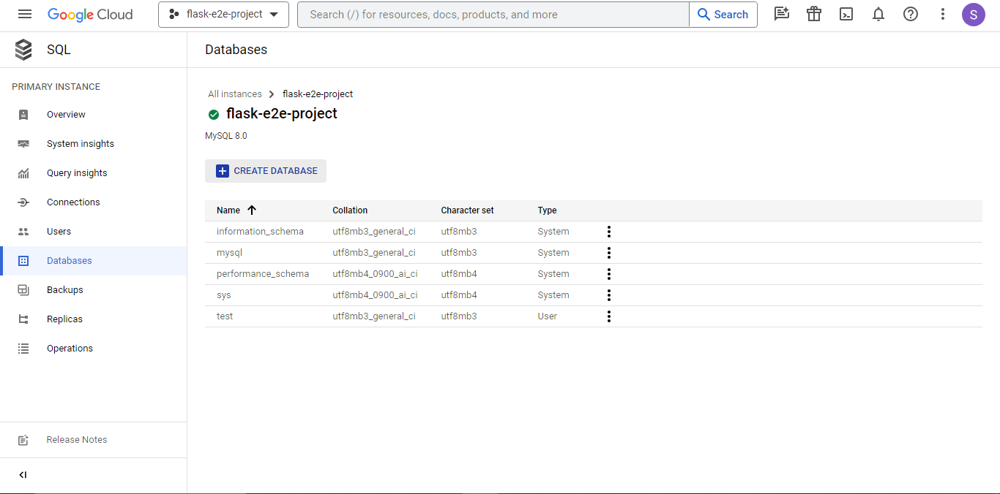
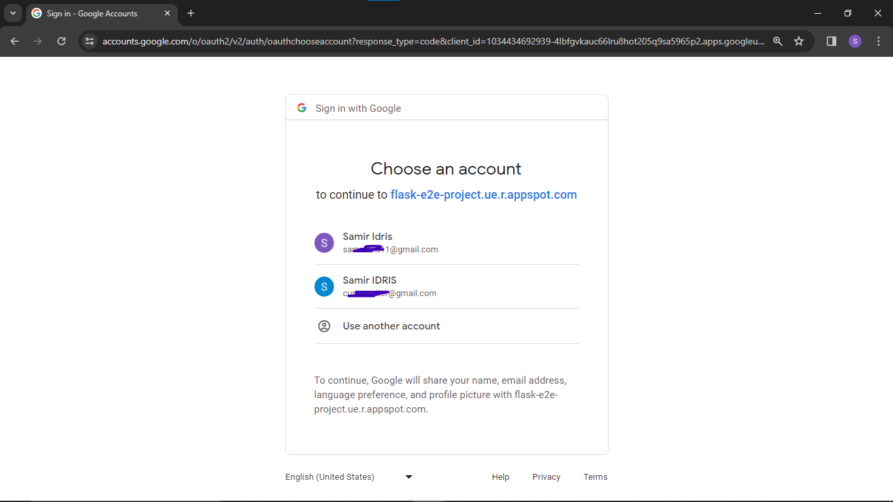

# Mood Tracker

This is the documentation of the whole process of the project creation


## Git and GitHub

- Create and initialize a new github repository


- Clone the the repository on Google Cloud shell or a machine of your choice


## Google Authentication

- Get google client id and key from the console to configure google authentication
- Apis and Services > Credentials > Create Credentials > OAuth client ID.
- Choose Web Application and configure to your choice in OAuth consent screen
- Copy the client id and secret. You will need them later


- Set the authorized javascript origin and authorized redirect URIs. Note the "/login/callback" at the end of the authorized redirect URIs.


- Add the client id and client secret to `.env`


## Application and routes

- While in the root project directory, `flask_e2e_project`, set up a python virtual environment and activate it


- Install depencies to start creating the google auth and setup up sqlalchemy: `pip install requests Flask oauthlib pyOpenSSL Flask-Login python-dotenv Flask-SQLAlchemy`


- Setup the database models


- Configure Authentication and the database in `app/app.py`. Notice the environment variables: `SECRET_KEY` and `DATABASE_URL`
- For `SECRET_KEY`, create a secret key
- For `DATABASE_URL`, we will be creating the database and configuring it later in the steps.


- Create routes including the routes to add moods.


- Create login page template


- Create index page template


- Now, creating the database in google cloud console
- Go to the console > Create a database > Choose MySQL
- Setup instance id and optional password. Choose enterprise edition and sandbox then click "Create Instance"


## GCP Database


- Once created, select the instance. This is the database URI format we are using: `mysql+pymysql://<username>:<password>@<host>:<port>/<db_name>`.
- We are going to use pymsql. Install it using `pip install pymysql`
- We need a username and password linked to the database, the database IP address, it's port, and the database name.
- Database username and password: Once the database is selected, go to users, create a new user or use the root user and configure/change a password


- Database Name: Go to Databases > Create a new database. A database with the name `test` was created



- Database host: Go to connections > Copy the Public IP address of the database
- Port: The default port of mysql databse is `3306`


- Still in connections, move to Networking section and add authorized networks. Add all networks as in the screenshot or add your IP address


- Now, add the final database URI to `.env`.
- PS: the `dotenv` python module is used to load environment variables


- Start the app with `python app/app.py` while in the root directory
- You can can view the app with web preview and changing port number to `5000`


## Logging

- Add logging with sentry.io > projects > create new project with the framework, flask


- Install sentry_sdk with `pip install sentry-sdk`
- import sentry_sdk with `import sentry_sdk`
- Configure sentry_sdk in the app as in the screenshot below with `sentry_sdk.init()`:


## Deploy Application

- In gcp terminal, do:
```
gcloud auth login
gcloud config set project flask_e2e_project
gcloud app deploy
```

## Dockerize Application

- While in the project root directory:
```
docker build -t <username>/flask_e2e_project .
docker login
docker push <username>/flask_e2e_project
```


## Live Application

- Live app URL: https://flask-e2e-project.ue.r.appspot.com/




